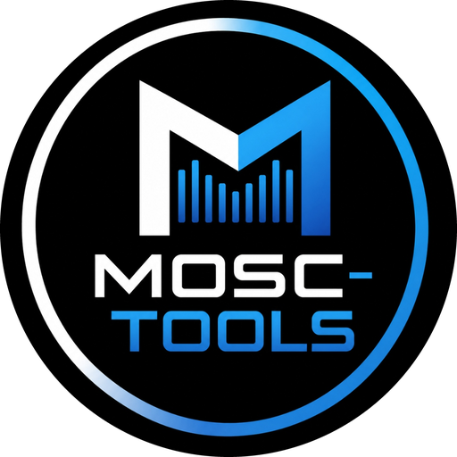
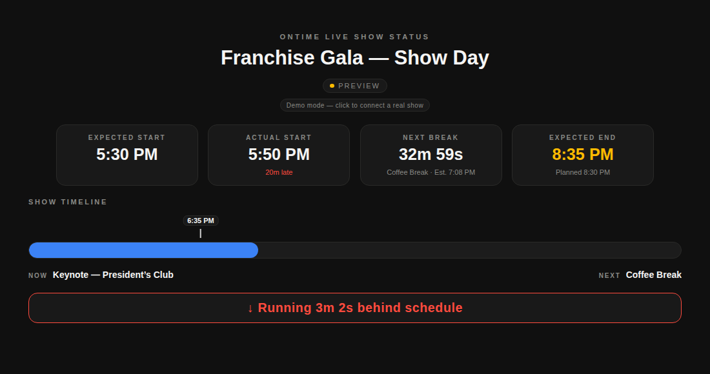
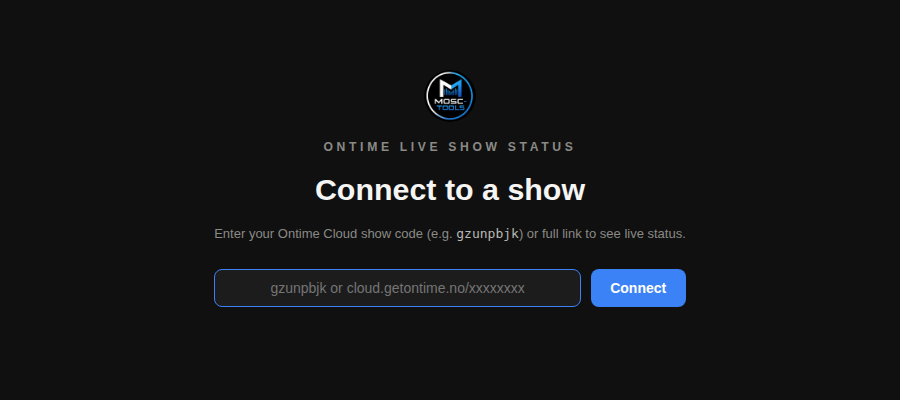
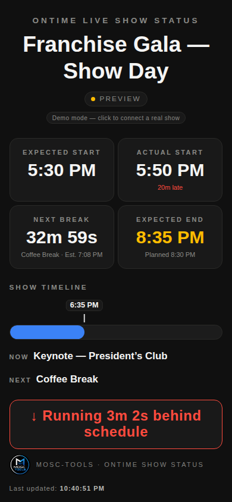

  

<h1 align="center">Mosc-tools — Ontime Live Show Status</h1>

  A mobile-friendly, client-facing status page for <a href="https://www.getontime.no/">Ontime</a>. 
  Expected/actual times, a show timeline, and an honest ahead/behind indicator — no app, no login.

  
  &nbsp;
  
  &nbsp;
  

## Why

Clients, planners, and stakeholders always want to know one thing on show day: are we on
time? Ontime's own views are built for the booth, not for texting a producer a link they can
check from their phone in the lobby. This is that link — a single, calm page that answers
"are we on time" at a glance, and nothing else.

Built to hand off: no login, no install, works on any phone, and never shows a client anything
sharper than "running a few minutes behind."

## What you get

- **Expected / Actual Start, Next Break, Expected End** — four clean cards. Next Break finds
  the next green-coloured line in your rundown and counts down to it, adjusted for how the
  show is actually running — not just the planned time. Expected End shows the live projected
  finish time, colored amber when it's trending late and green when it's trending early; a
  small "Planned" line underneath keeps the original schedule in view.
- **Show timeline** — a progress bar from the event's planned start to end, with a live
  "now" marker, so anyone can see where the show actually is at a glance.
- **Now / Next** — the currently running cue and what's coming up next.
- **Ahead/behind schedule banner** — a plain-language line ("Running 3m behind schedule" /
  "Running 2m ahead of schedule" / on schedule), colored red when behind and green when ahead.
- **First-run setup screen** — land on the page with no config and it asks for your Ontime
  Cloud show code (e.g. `showcode`) or full share link. No hardcoded show baked into the file.
- **Click-to-change link** — click either pill under the title any time to point the page at
  a different show; it's remembered in the browser for next time. Both live up top, above
  where a phone's on-screen keyboard would otherwise cover them.
- **Live updates over WebSocket**, with an HTTP fallback heartbeat and automatic reconnect if
  the connection drops (including a timeout guard for networks that silently swallow the
  WebSocket upgrade instead of erroring).

## Quick start

**Option 1 — just open it.** [Download the zip](https://github.com/professorpete/mosc-tools-ontime-show-status/archive/refs/heads/main.zip),
unzip, and open `index.html` in any browser. On first load it'll ask for your Ontime Cloud
show code or link — paste it in and you're live.

Want to see it before you download? The [live demo](https://professorpete.github.io/mosc-tools-ontime-show-status/?demo=1)
runs the exact same file with fake show data.

**Option 2 — host it anywhere.** It's a static file — any web server, S3 bucket, or GitHub
Pages works. Send clients the URL once and they can bookmark it; the show link is saved in
their browser after the first visit.

**Skip the setup screen entirely.** If you're hosting it yourself, put the show code right in
the URL you send the client — `https://your-host.com/index.html?link=showcode` — and they
land straight on the live status page, never seeing the "Connect to a show" screen at all.

### URL parameters

| Parameter | What it does | Default |
| --- | --- | --- |
| `?link=cloud.getontime.no/showcode` | Ontime Cloud show to connect to — accepts a bare code (`?link=showcode`) or the full link | — (asks on first load) |
| *(none — on-screen)* | Click the status pill to change the show without editing the URL; it's saved in the browser | — |
| `?demo=1` | Demo mode with fake show data (for testing looks) | off |

## How it talks to Ontime

- **WebSocket** for live updates: running/next cues, timers, and the schedule offset.
  Reconnects automatically with backoff, and force-closes a socket that hangs on open so it
  never gets stuck on "Connecting…".
- **HTTP** for the rundown/project title and a periodic host heartbeat.

## Make it yours

Colors live in one `:root` block at the top of `index.html` — background, the "behind
schedule" red, the "ahead of schedule" green, the accent blue. The logo is embedded as a
data URI in three spots (favicon, setup screen, footer) — swap in your own PNG and
re-encode to rebrand.

## Support

Questions or ideas: [mosc-tools@moscone.ca](mailto:mosc-tools@moscone.ca)

If this tool saved your show day, consider
[buying me a coffee](https://buymeacoffee.com/mosctools) ☕ — it keeps the Mosc-tools
side projects alive.

MIT licensed.
